# WorkCells

WorkCells es una aplicación gestora de recursos humanos. Ésta aplicación permite poder gestionar las vacaciones, ausencias y faltas administrativas de los empleados mientras que los divide en departamentos, los cuales a su vez están divididos por empresas a las cuales pertenecen.

## Índice:

-   [Avances](#avances)
-   [Guía de despliegue](#guía-de-despliegue)

## Avances:

### Avance 2:

Enlace al video: [Presionar aquí](https://drive.google.com/file/d/17NkRQka-b3vlwttzGhn5-bTHge6w62Ak/view?usp=sharing).

Enlace a su carpeta: [Presionar aquí](https://github.com/EdCanCe/WorkCells/tree/main/avances/avance2)

### Avance 3:

Enlace a su carpeta: [Presionar aquí](https://github.com/EdCanCe/WorkCells/tree/main/avances/avance3)

### Avance 4:

Enlace a su carpeta: [Presionar aquí](https://github.com/EdCanCe/WorkCells/tree/main/avances/avance4)

Enlace al video: [Presionar aquí](https://drive.google.com/file/d/1TlZrb2CoErQfLo6_-b29Wmh_rFuy_MfT/view?usp=sharing).

### Avance 5:

Enlace al video: [Presionar aquí](https://drive.google.com/file/d/12XiT6-eZ0QDHi_UXawbCFdu2X9BmJ-7w/view?usp=sharing)

Enlace a su carpeta: [Presionar aquí](https://github.com/EdCanCe/WorkCells/tree/main/avances/avance5)

## Guía de despliegue:

Para poder desplegar `WorkCells` correctamente, se tienen que cumplir con los siguientes puntos:

-   [Obtención de API KEYS](#obtención-de-api-keys)
    -   [Whatsapp API](#whatsapp-api)
    -   [Google Auth API](#google-auth-api)
    -   [Geoapify API](#geoapify-api)
-   [Obtención del servidor](#obtención-del-servidor)
    -   [Lanzar instancia en AWS](#lanzar-instancia-en-aws)
    -   [Acceso en la terminal](#acceso-en-la-terminal)
-   [Levantamiento del servidor](#levantamiento-del-servidor)
    -   [Instalación de paquetes necesarios](#instalación-de-paquetes-necesarios)
    -   [Descarga del repositorio](#descarga-del-repositorio)
    -   [Levantar base de datos](#levantar-base-de-datos)
    -   [Llenado del archivo .env](#llenado-del-archivo-env)
    -   [Ejecutar aplicación de forma persistente](#ejecutar-aplicación-de-forma-persistente)
    -   [Uso de proxy](#uso-de-proxy)

### Obtención de API KEYS:

Para el correcto funcionamiento de la aplicación, se enlaza con las siguientes API's:

-   [Whatsapp API](#whatsapp-api): Manda mensajes al empleado notificando de actualizaciones referentes a sus ausencias y vacaciones.
-   [Google Auth API](#google-auth-api): Permite iniciar sesión a través de Google.
-   [Geoapify API](#geoapify-api): Permite obtener la ciudad y estado del usuario usando parte de su dirección como parámetro.

Las llaves de estas API's posteriormente se tendrán que incluir en un archivo `.env` en un [formato en específico](#llenado-del-archivo-env) para que el sistema las pueda reconocer.

#### Whatsapp API:

Para poder obtener la llave que permita el funcionamiento de esta API se tienen que seguir los siguientes pasos:

1. Realizar una cuenta de Business Meta y Developer Meta.
1. Una vez configurados, ahora tenemos que crear nuestra App desde Developer Meta.
1. Seleccionamos la opción de WhatsApp.
1. Configuramos un número de prueba.
    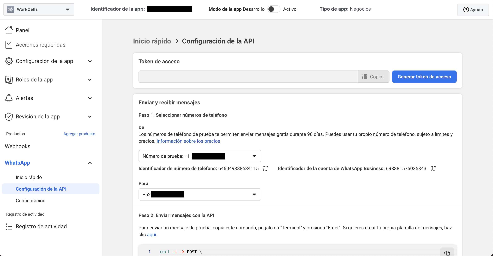
1. Ahora, en Business Meta, en el panel principal, configuramos una plantilla de mensaje para enviar por WhatsApp.
    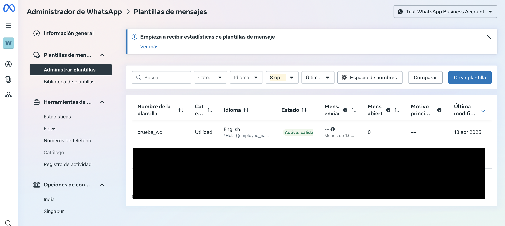
1. En esta parte, también configuramos y guardamos nuestro token permanente. Para esto, nos debemos de ir a la configuración de la empresa > Usuarios del Sistema > Generar Token. _(Guardar el token, ya que posteriormente se ingresará al archivo `.env`)_
    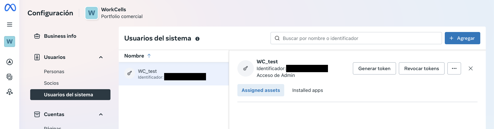

En la aplicación actualmente sólo funciona con un número de prueba, independientemente del empleado; siempre se manda al mismo número. Esto ya que para poder mandar a más números, se necesita agregar un método de pago dentro de Business Meta.

_Para más información, se puede acceder directamente a la [documentación de la API de Whatsapp](https://developers.facebook.com/docs/whatsapp/cloud-api/get-started)_.

#### Google Auth API:

Para poder obtener la llave que permita el funcionamiento de esta API se tienen que seguir los siguientes pasos:

1. Entrar a este [enlace](https://console.cloud.google.com/projectselector2/apis/credentials?supportedpurview=project&allowsmanagementprojects=true&authuser=1).
1. Iniciar sesión y seguir los pasos hasta tener acceso a la ventana principal de Google credentials.
   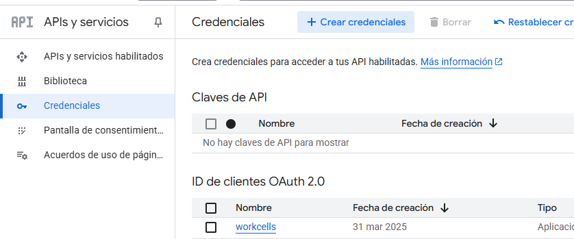
1. Ingresar a la sección de credenciales y dar click en crear credenciales.
   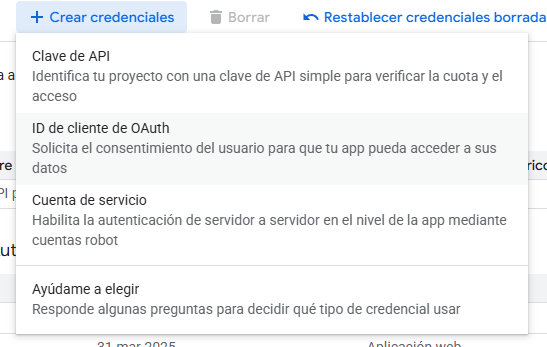
1. Aparecerá un desplegable con varias opciones, sin embargo, la que nos interesa es la opción de _"ID de cliente de OAuth"_.
1. Aparecerá un formulario pidiendo información general de la app. Primero aparece el tipo de aplicación, en este caso _"Aplicación Web"_, después pide el nombre, el cual es únicamente para identificar las credenciales propias, así que no es relevante. Se optó por poner el nombre de la app _"Workcells"_, pero puede elegir el que usted crea conveniente.
   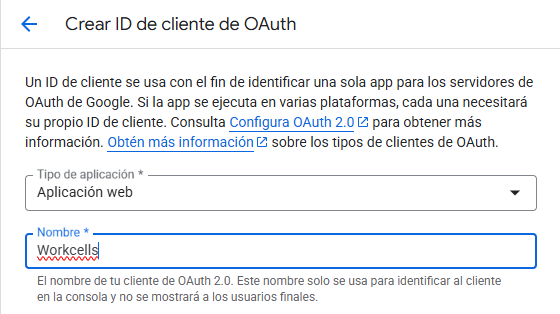
1. En este mismo formulario está la sección de "URIs de redireccionamiento autorizados". Aquí se agregan las rutas a donde queremos mandar los usuarios si la autentificación con Google fue exitosa. Aquí agregamos lo siguiente: https://mi.dominio.com/google/callback _(Cambiando [mi.dominio.com]() por su dominio)_
   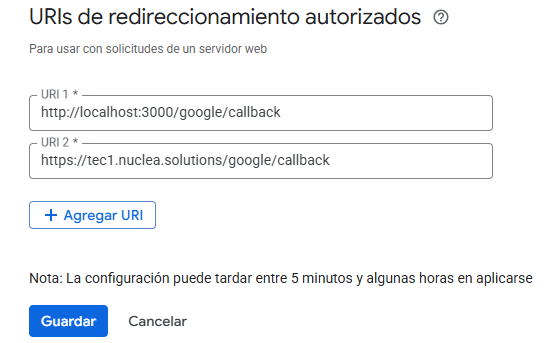
1. Hacer click en el botón de continuar.
1. Aparecerá una nueva ventana, en la parte derecha de ésta estará una sección de información adicional. Aquí le prestaremos especial atención a las variables de ID del cliente `CLIENT_ID` y secreto del cliente `CLIENT_SECRET`. _(Guardamos ambos tokens, ya que posteriormente se ingresarán al archivo `.env`)_
   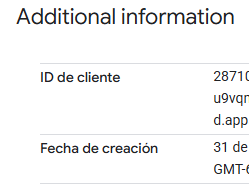
   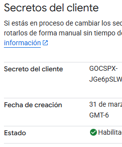

_Para más información, se puede acceder directamente a la [documentación de Google Auth](https://www.google.com/url?sa=t&source=web&rct=j&opi=89978449&url=https://developers.google.com/identity/protocols/oauth2%3Fhl%3Des-419&ved=2ahUKEwiK-ZrTrfqMAxXeO0QIHa1mF-EQFnoECCEQAQ&usg=AOvVaw3qAmVBwVd0lG6Hs3Z05_-y)_.

#### Geoapify API:

Para poder obtener la llave que permita el funcionamiento de esta API se tienen que seguir los siguientes pasos:

1. Entrar a este [enlace](https://www.geoapify.com/get-started-with-maps-api/).
1. Crear una cuenta dentro del sitio de Geoapify.

1. Entrar a este [enlace](https://myprojects.geoapify.com/projects).
1. Crear un nuevo proyecto e ingresar el nombre del mismo. Presionar en _"Ok"_ y esperar a que nos redireccionen.
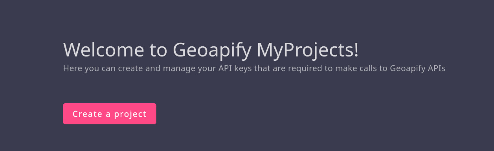
1. En la parte de arriba de la página dirá _"API Keys"_, dentro de este apartado estará nuestra llave, por lo que la guardaremos. _(Guardar el token, ya que posteriormente se ingresará al archivo `.env`)_
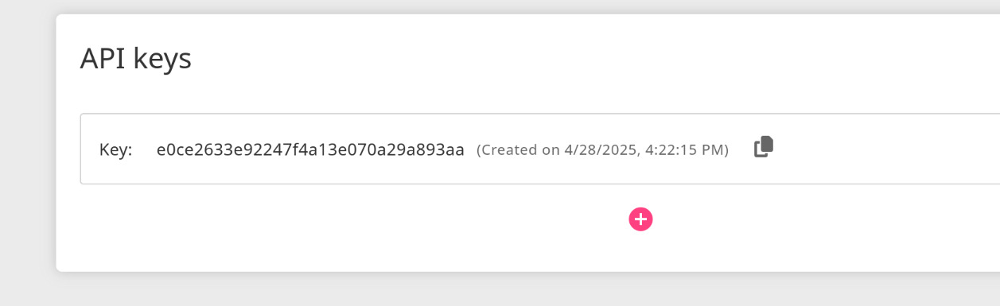

_Para más información, se puede acceder directamente a la [documentación de la API de Geoapify](https://apidocs.geoapify.com/docs/geocoding/forward-geocoding/)_.

### Obtención del servidor:

Para correr nuestro proyecto, vamos a ocupar un servidor para ejecutar los servicios que ocupa nuestra aplicación, por lo que se usará un VPS para alojarlo.

#### Lanzar instancia en AWS:

En este caso vamos a usar [AWS](https://aws.amazon.com/), pero se puede usar cualquier hosting de servidores VPS. A continuación se detallan los pasos para lanzar la instancia en AWS.

En AWS hay varios servicios de cloud, sin embargo, [EC2](https://aws.amazon.com/ec2/) es el que usaremos, ya que es un VPS flexible, es decir, dependiendo de la carga que esté recibiendo nuestro servidor, puede aumentar o disminuir la capacidad del mismo. Los pasos para iniciar una instancia de EC2 son los siguientes:

1. Acceder a [AWS](https://aws.amazon.com/).
1. Crear una cuenta y seguir los pasos que indique hasta finalizar el proceso.
1. Acceder al [dashboard de EC2](https://us-east-1.console.aws.amazon.com/ec2/home).
1. Presionar en _"Launch Instance"_.
1. Rellenar los datos de nuestra instancia según nuestros intereses. Únicamente se recomienda que al escoger el sistema operativo, se escoja una distribución de Linux, en específico Ubuntu _(ya que es una de las distribuciones con más soporte)_; y también se recomienda que al llegar al apartado de _"Key Pair"_ se presione en _"Create new pair"_, lo que permitirá acceder al servidor por medio de `SSH` desde otra computadora.
1. Con la configuración de la instancia terminada, presionar en _"Launch instance"_.

#### Acceso en la terminal:

Con nuestra instancia ya creada, tendremos que seguir los siguientes pasos para interactuar con la terminal y realizar los pasos subsecuentes.

1. Ingresar a nuestra instancia recién creada.
1. Presionar en el apartado de _"Connect"_ en la parte superior derecha.
1. Por defecto nos posisionará en _"EC2 Instance Connect"_, en caso de querer acceder a través de nuestro navegador, presionar en _"Connect"_. En caso de que queramos usar otro tipo de acceso seguir los pasos que nos proporciona la misma página.

Para éste punto ya tendremos acceso a la terminal. Los pasos subsecuentes serán seguir una serie de comandos en nuestra terminal, los cuales los haremos aquí.

### Levantamiento del servidor:

Una vez con el servidor en nuestras manos, tendremos que seguir una serie de comandos para poder ejecutar nuestra aplicación y permitir que varios dispositivos puedan aceder, por lo que tendremos que realizar lo que se indica en los siguientes puntos:

-   [Instalación de paquetes necesarios](#instalación-de-paquetes-necesarios)
-   [Descarga del repositorio](#descarga-del-repositorio)
-   [Levantar base de datos](#levantar-base-de-datos)
-   [Llenado del archivo .env](#llenado-del-archivo-env)
-   [Ejecutar aplicación de forma persistente](#ejecutar-aplicación-de-forma-persistente)
-   [Uso de proxy](#uso-de-proxy)

#### Instalación de paquetes necesarios:

Antes de continuar, asegúrate de instalar los paquetes necesarios para ejecutar la aplicación.  
Puedes hacerlo con el siguiente comando (o su equivalente en tu distribución):

```bash
sudo apt update # para actualizar el gestor de paquetes
sudo apt install git nodejs npm mariadb-server nginx ufw -y
```

-   `git`: para poder clonar el respositorio.
-   `nodejs`: para poder levantar el servidor.
-   `npm`: para poder descargar las dependencias del repositorio.
-   `mariadb-server`: como nuestro gestor de base de datos.
-   `nginx`: como nuestro proxy.
-   `ufw`: para manejar el firewall.

#### Descarga del repositorio:

No es necesario, pero es recomendable crear una carpeta donde incluirás tu proyecto para tener más organización en tu servidor.

```bash
mkdir 'proyectos' # crea la carpeta
cd 'proyectos' # nos mueve a la carpeta
```

Dentro de nuestra carpeta, hacemos un `git clone` hacia nuestro repositorio, para poderlo tener de manera local.

```bash
git clone https://github.com/EdCanCe/WorkCells.git
```

Una vez con el repositorio creado, nos dirigimos a la carpeta de nuestro repositorio e instalamos las dependencias necesarias para su ejecución.

```bash
cd workcells # nos movemos a la carpeta de nuestro repositorio
npm install # instalamos sus dependencias
```

#### Levantar base de datos:

Primeramente tenemos que habilitar y arrancar nuestro gestor de base de datos con:

```bash
sudo systemctl enable mariadb # permite que se ejecute cada vez que arranque el servidor
sudo systemctl start mariadb # levanta el gestor de base de datos
```

Ahora, ocupamos crear nuestras credenciales, por lo que corremos la configuración inicial de nuestro gestor (contestamos de acuerdo a lo que queramos):

```bash
sudo mysql_secure_installation
```

Ahora crearemos levantamos nuestra base de datos, por lo que corremos el script siguiente para acceder a nuestro gestor de base de datos:

```bash
sudo mariadb
```

Cargaremos algunos datos iniciales, por lo que, aún dentro de mariadb, vamos a copiar los contenidos de [este archivo](/sql/loadDB.sql) en la terminal. Al final presionamos enter.

Dentro de mariadb crearemos nuestro usuario con un comando parecido:

```sql
CREATE USER '[TU USUARIO]'@'%' IDENTIFIED BY '[LA CONTRASEÑA DE TU ELECCION]'; -- crea el usuario
GRANT ALL PRIVILEGES ON *.* TO '[TU USUARIO]'@'%' WITH GRANT OPTION; -- le da permisos de edición
FLUSH PRIVILEGES;
```

Escribimos `exit` para salir de mariadb.

Teniendo la base de datos levantada, se ocuparía habilitar el puerto para que se pueda acceder.

En la configuración de mariadb permitir que se pueda acceder a dicho puerto, por lo que correr éste comando para editar su configuración:

```bash
sudo nano /etc/mysql/mariadb.conf.d/50-server.cnf
```

Y ahí buscar `bind-address = 127.0.0.1` y cambiarlo a `bind-address = 0.0.0.0`, ésto hace que se pueda acceder a mariadb desde cualquier dirección IP.

Posteriormente reiniciar mariadb para que se carguen los cambios realizados.

```bash
sudo systemctl restart mariadb
```

Habilitar el puerto 3306 en el firewall para que se pueda acceder a él:

```bash
sudo systemctl enable ufw
sudo systemctl start ufw # Habilitar el firewall
sudo ufw allow 3306/tcp
```

#### Llenado del archivo .env:

El archivo `.env` contiene información sensible, por esa razón no se subió al repositorio. Sin embargo, es necesario para la ejecución de nuestro programa. Es debido a esto que se tiene que crear manualmente.

Para crear el archivo, dentro de la carpeta de `workcells` ejecutamos el comando `touch .env` para crear el archivo, y con nuestro editor de texto de preferencia le añadimos lo siguiente:

```
GEOLOCATION_API_KEY=[TU TOKEN DE GEOAPIFY]
CLIENT_ID=[TU TOKEN DE CLIENT ID DE GOOGLE AUTH]
CLIENT_SECRET=[TU TOKEN DE CLIENT SECRET DE GOOGLE AUTH]
WHATSAPP_VERSION=[LA VERSION DE WHATSAPP A USAR]
WHATSAPP_PHONE_NUMBER_ID=[EL ID DEL NÚMERO DE WHATSAPP]
NUMBER_TEST=[NÚMERO DE TELÉFONO DE PRUEBA]
WHATSAPP_TOKEN=[TU TOKEN DE WHATSAPP API]
DATABASEIP=[LA IP DE TU SERVIDOR]
DATABASEUSER=[EL USUARIO DE TU BASE DE DATOS]
DATABASEDB=workcells
DATABASEPW=[LA CONTRASEÑA DE TU BASE DE DATOS]
```

#### Ejecutar aplicación de forma persistente:

Para éste punto ya podemos acceder a nuestro proyecto al acceder a nuestra dirección ip junto con nuestro puerto, en caso de no poder, intentar con:

```bash
sudo ufw allow 3008/tcp # permite el acceso al puerto 3008
```

En caso de que no se pueda, es posible que el servicio que aloja el servidor tenga su propio firewall, por lo que ahí también se tendrían que habilitar los puertos 3306 y 3008 para acceder a ellos.

Para correr la aplicación de forma persistente, dentro de la carpeta de `workcells`, se va a ocupar instalar otro paquete, ésto lo hacemos con:

```bash
npm install pm2
```

Y lo ejecutamos con:

```bash
npx pm2 start app.js
```

En caso de querer parar el proyecto lo hacemos con:

```bash
npx pm2 delete 0
```

#### Uso de prox:y

Si quisiéramos acceder directamente a través del puerto 443 u 80 _(por medio de protocolos HTTPS y HTTP)_, vamos a ocupar nginx _(ya que actualmente está en el 3008)_; por lo que se va a modificar su configuración con:

```bash
sudo nano /etc/nginx/sites-available/default
```

Dependiendo del tipo de conexión que quisiéramos tener, se ocupa modificar el contenido del archivo de manera distinta:

1.  **Conexión HTTP** _(conexión insegura)_

    Se tiene que tener éste contenido:

    ```nginx
    server {
        listen 80; # Para la conexión HTTP

        server_name _;  # Cambia por tu dominio o IP

        location / {
            proxy_pass http://localhost:3008;  # Redirige a workcells en el puerto 3008
            proxy_set_header Host $host;
            proxy_set_header X-Real-IP $remote_addr;
            proxy_set_header X-Forwarded-For $proxy_add_x_forwarded_for;
            proxy_set_header X-Forwarded-Proto $scheme;
        }
    }
    ```

    Para corroborar que el archivo está escrito correctamente, correr:

    ```bash
    sudo nginx -t
    ```

    En caso de que esté escrito correctamente, correr:

    ```bash
    sudo systemctl restart nginx # aplica los cambios en la configuración
    ```

1.  **Conexión HTTPS con certificado SSL autofirmado** _(conexión segura, pero frustante para usuarios)_

    Para realizar éste tipo de conexión no es necesario ningún requerimiento extra, lo único negativo es que la primera vez que el usuario entre a la página, le dirá que no es segura, ya que el certificado SSL está autofirmado.

    Antes de modificar nginx, ocupamos generar nuestro certificado, y para hacerlo vamos a ocupar instalar ciertos paquetes.

    ```bash
    sudo apt install openssl
    ```

    Primeramente vamos a ocupar generar la clave privada con:

    ```bash
    sudo openssl genpkey -algorithm RSA -out /etc/ssl/private/server.key
    ```

    Luego, vamos a generar el certificado autofirmado con:

    ```bash
    sudo openssl req -new -key /etc/ssl/private/server.key -out /etc/ssl/certs/server.csr
    ```

    Y posteriormente, generar el archivo que va a usar nginx (éste certificado dura 1 año):

    ```bash
    sudo openssl x509 -req -in /etc/ssl/certs/server.csr -signkey /etc/ssl/private/server.key -out /etc/ssl/certs/server.crt -days 365
    ```

    Ya solo restaría volver a modificar nginx para indicar que se va a usar un certificado ssl y reiniciarlo. Por lo que seguiremos los siguientes pasos:

    Primeramente vamos a volver a editar el archivo de nginx:

    ```bash
    sudo nano /etc/nginx/sites-available/default
    ```

    Y le añadiremos éste contenido:

    ```nginx
    server {
        listen 80;
        server_name _; # Cambia por tu dominio o IP

        return 301 https://$host$request_uri; # Manda solicitudes HTTP a HTTPS
    }

    server {
        listen 443 ssl;
        server_name _; # Cambia por tu dominio o IP

        ssl_certificate /etc/ssl/certs/server.crt;
        ssl_certificate_key /etc/ssl/private/server.key;

        location / {
            proxy_pass http://localhost:3008; # Redirige a workcells en el puerto 3008
            proxy_set_header Host $host;
            proxy_set_header X-Real-IP $remote_addr;
            proxy_set_header X-Forwarded-For $proxy_add_x_forwarded_for;
            proxy_set_header X-Forwarded-Proto $scheme;
        }
    }
    ```

    Para corroborar que el archivo está escrito correctamente, correr:

    ```bash
    sudo nginx -t
    ```

    En caso de que esté escrito correctamente, correr:

    ```bash
    sudo systemctl restart nginx # aplica los cambios en la configuración
    ```

1.  **Conexión HTTPS con certificado SSL y conexión segura** _(conexión segura)_

    Para realizar éste tipo de conexión es necesario contar con un dominio o subdominio.

    Antes de modificar nginx, ocupamos generar nuestro certificado, y para hacerlo vamos a ocupar instalar ciertos paquetes.

    ```bash
    sudo apt install certbot python3-certbot-nginx
    ```

    Primeramente vamos a generar el certificado SSL _(asegúrate de cambiar [tudominio.com]() por tu dominio)_:

    ```bash
    sudo certbot --nginx -d tudominio.com
    ```

    Posiblemente muestre un error de que no se pudo instalar, no hay problema ya que eso lo haremos manualmente; mientras diga que el certificad se guardó, podemos pasar al siguiente paso.

    Ya solo restaría volver a modificar nginx para indicar que se va a usar un certificado ssl y reiniciarlo. Por lo que seguiremos los siguientes pasos:

    Primeramente vamos a volver a editar el archivo de nginx:

    ```bash
    sudo nano /etc/nginx/sites-available/default
    ```

    Y le añadiremos éste contenido:

    ```nginx
    server {
        listen 80;
        server_name tudominio.com;

        return 301 https://$host$request_uri; # Redirige todo el tráfico HTTP a HTTPS
    }

    server {
        listen 443 ssl;
        server_name tudominio.com;

        ssl_certificate /etc/letsencrypt/live/tudominio.com/fullchain.pem;
        ssl_certificate_key /etc/letsencrypt/live/tudominio.com/privkey.pem;

        # Opciones de seguridad adicionales
        ssl_protocols TLSv1.2 TLSv1.3;
        ssl_ciphers 'HIGH:!aNULL:!MD5';
        ssl_prefer_server_ciphers on;

        location / {
            proxy_pass http://localhost:3008; # Redirige a workcells en el puerto 3008
            proxy_set_header Host $host;
            proxy_set_header X-Real-IP $remote_addr;
            proxy_set_header X-Forwarded-For $proxy_add_x_forwarded_for;
            proxy_set_header X-Forwarded-Proto $scheme;
        }
    }
    ```

    Solo asegúrate de modificar [tudominio.com]() a tu dominio. Tienes que editarlo en los `server_name` y `ssl_certificate`'s.

    Para corroborar que el archivo está escrito correctamente, correr:

    ```bash
    sudo nginx -t
    ```

    En caso de que esté escrito correctamente, correr:

    ```bash
    sudo systemctl restart nginx # aplica los cambios en la configuración
    ```

#### Levantar PhpMyAdmin (opcional)

Primeramente instalar paquetes necesarios:

```bash
sudo apt update
sudo apt install phpmyadmin php-mbstring php-zip php-gd php-json php-curl php-mysql php8.2-fpm-y
```

Luego se tienen que habilitar las extensiones de php:

```bash
sudo phpenmod mbstring
sudo systemctl restart php7.*-fpm  # Asegúrate de que coincida con tu versión de PHP
```

Se crea el enlace simbólico de la carpeta de phpMyAdmin:

```bash
sudo ln -s /usr/share/phpmyadmin /var/www/html/phpmyadmin
```

Ya solo faltaría modificar nginx para aceptar la ruta con:

```bash
sudo nano/etc/nginx/sites-available/default
```

Y añadir:

```nginx
    location /phpmyadmin {
        alias /usr/share/phpmyadmin/;
        index index.php index.html index.htm;

        location ~ ^/phpmyadmin/(.+\.php)$ {
            alias /usr/share/phpmyadmin/$1;
            include fastcgi-params;
            fastcgi_pass unix:/run/php/php7.X-fpm.sock;  # Cambia "7.X" por tu versión de PHP
            fastcgi_index index.php;
            fastcgi_param SCRIPT_FILENAME /usr/share/phpmyadmin/$1;
        }

        location ~* ^/phpmyadmin/(.+\.(jpg|jpeg|gif|css|png|js|ico|html|xml|txt))$ {
            alias /usr/share/phpmyadmin/$1;
        }
    }
```

Y faltaría reiniciar nginx para actualizar los cambios:

```bash
sudo systemctl restart nginx
```
